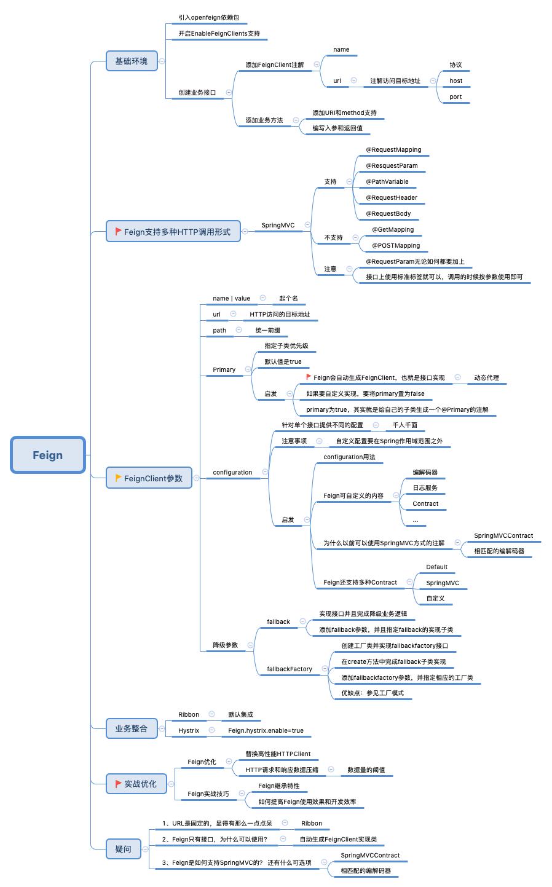
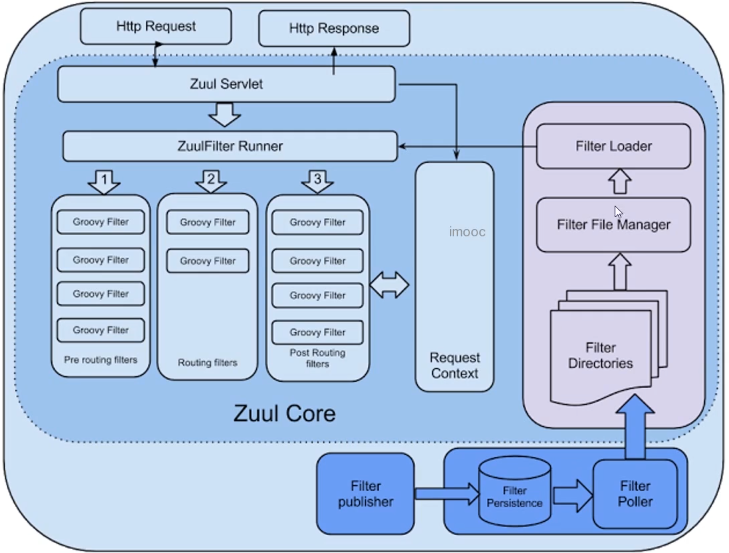
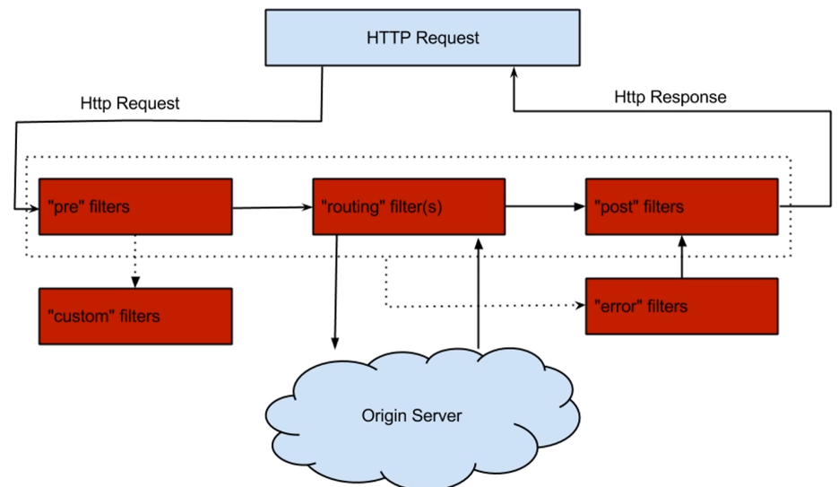
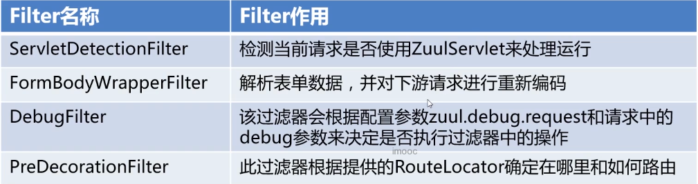
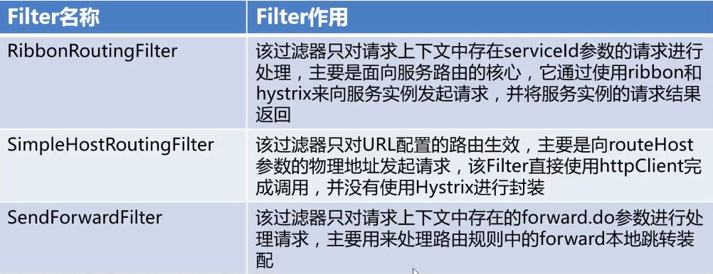
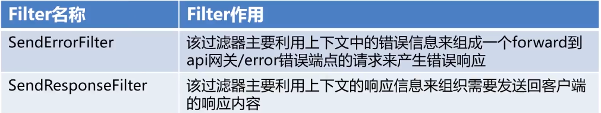
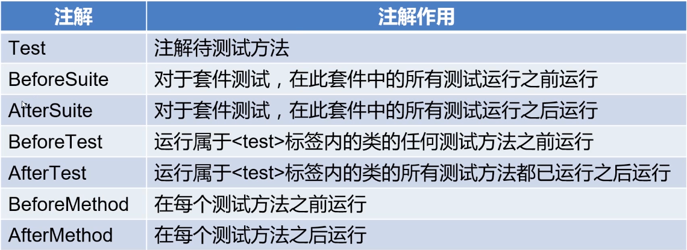

# Table of Contents

  * [Eureka核心特性](#eureka核心特性)
    * [服务注册](#服务注册)
    * [服务续约](#服务续约)
    * [服务下线](#服务下线)
    * [获取注册列表信息](#获取注册列表信息)
  * [Eureka面试点](#eureka面试点)
    * [注册中心比较](#注册中心比较)
    * [Eureka注册慢问题](#eureka注册慢问题)
    * [Eureka的自我保护](#eureka的自我保护)
  * [Ribbon负载均衡](#ribbon负载均衡)
    * [概述](#概述)
    * [Ribbon的核心](#ribbon的核心)
      * [IRule](#irule)
      * [IPing](#iping)
      * [ServerList](#serverlist)
  * [Hystrix](#hystrix)
    * [概述](#概述-1)
    * [主要作用](#主要作用)
    * [两种命令模式](#两种命令模式)
    * [配置GroupKey](#配置groupkey)
    * [配置CommandKey](#配置commandkey)
    * [请求缓存](#请求缓存)
    * [请求合并](#请求合并)
    * [隔离术](#隔离术)
    * [降级处理](#降级处理)
      * [降级触发原则](#降级触发原则)
      * [快速失败](#快速失败)
    * [熔断机制](#熔断机制)
  * [Feign](#feign)
    * [概述](#概述-2)
    * [特性](#特性)
    * [Feign继承](#feign继承)
    * [面试点](#面试点)
      * [Feign之HTTP性能优化](#feign之http性能优化)
      * [Feign之HTTP解压缩](#feign之http解压缩)
  * [Zuul](#zuul)
    * [概述](#概述-3)
    * [ZuulFilter生命周期](#zuulfilter生命周期)
    * [自定义Filter](#自定义filter)
    * [核心PreFilter](#核心prefilter)
    * [核心RoutingFilter](#核心routingfilter)
    * [核心PostFilter](#核心postfilter)
    * [面试点](#面试点-1)
      * [Zuul和Zuul2](#zuul和zuul2)
      * [Cookie和头信息处理](#cookie和头信息处理)
  * [自动化测试](#自动化测试)
    * [重要性](#重要性)
    * [TestNG](#testng)
    * [概述](#概述-4)
    * [自动化测试报告](#自动化测试报告)

## Eureka核心特性

### 服务注册
* Eureka Client在第一次心跳时Eureka Server注册
* 注册时提供诸多元数据: 主机名, 端口, 健康指标URL等
### 服务续约
* Eureka Client通过发送心跳进行续约
* 默认情况下是每30s发送一次心跳
* 如果90s内Eureka Server未收到续约, 则进行服务剔除 
### 服务下线
* Eureka Client优雅退出时会发送cancel的命令
* Eureka Server在收到cancel命令时会删除该节点
### 获取注册列表信息
* Eureka Client会缓存由Server获取的注册表信息
* Eureka Client会定期更新注册表信息, **默认是30s**
* Eureka Client会处理注册表的合并等内容
## Eureka面试点
### 注册中心比较
* 分布式基础CAP理论: 没有任何一个系统能同时满足CAP 
    * 一致性: Consistency
    * 可用性: Availability
    * 分区容错性: Partition tolerance
* 常见的注册中心: Zookeeper, Eureka等
* Eureka主要保证AP特性: 可用和容错
* Zookeeper主要保证CP特性: 一致和容错
### Eureka注册慢问题
* 根本原因在于Eureka的AP特性
* Eureka Client延迟注册, 默认30s
* Eureka Server的响应缓存, 默认30s
* Eureka Server的缓存刷新, 默认30s
### Eureka的自我保护
* Eureka Server会自动更新续约更新阈值
* 当Eureka Server续约更新频率低于阈值则进入保护模式
* 自我保护的模式下Eureka Server不会剔除任何的注册信息
## Ribbon负载均衡
### 概述
* Ribbon是**客户端**负载均衡器
* Ribbon核心功能: 服务发现, 服务的选择规则, 服务监听
### Ribbon的核心
#### IRule
* IRule通过特定的算法选取要访问的服务
* IRule的常用的算法: BestAvailableRule, WeightedResponseTimeRule

#### IPing
* 探测服务存活状态
* 是Ribbon保证服务可用的基石
* 常见的实现: NIWSDiscoveryPing, PingUrl

#### ServerList
* ServerList是Ribbon存储的可用服务列表
* ServerList可以手动设置
* ServerList常见应用是从Eureka中自动获取
## Hystrix

### 概述
* Hystrix是用于处理演出和容错的**开源库**
* Hystrix只要勇于避免联级故障, 提高系统的弹性
* Hystrix解决了由于扇出导致的 "雪崩效应"
* Hystrix核心是 "隔离术" 和 "熔断机制"

### 主要作用
* **服务隔离** 和 **服务熔断**
* **服务降级**, **限流** 和 **快速失败**
* 请求合并和请求缓存
* 自带单体和集群监控
### 两种命令模式
* HystrixCommand和HystrixObservableCommand
* Command会以隔离的形式完成run方法调用
* ObservableCommand使用当前线程进行调用
### 配置GroupKey
* Hystrix中GroupKey是唯一必填项
* GroupKey可以作为分组监控和报警作用
* GroupKey将作为线程池的默认名称
### 配置CommandKey
* Hystrix可以不填写CommandKey
* 默认Hystrix会反射类名命名CommandKey
* 在Setting中加入andCommandKey进行命名
### 请求缓存
* Hystrix支持将请求结果进行本地缓存
* 通过实现getCacheKey方法来判断是否取出缓存
* 请求缓存要求请求必须在同一个上下文
* 可以通过RequestCacheEnabled开启请求缓存
### 请求合并
* 支持多次请求合并成一次请求
* 请求合并要求两次请求必须足够的"近" (默认是10ms)
* 请求合并分为局部合并和全局合并两种
* Collapser可以设置相关参数
### 隔离术
* 提供了信号量和线程两种隔离手段
* 线程隔离会在单独的线程中执行业务逻辑
* 信号量隔离在调用线程上执行
* 官方推荐优先线程隔离
### 降级处理
* 降级是一种"无奈"的选择,简单说就是B方案
* Command降级需要实现fallback方法
* ObservableCommand降级实现ResumeWithFallback方法
#### 降级触发原则
* HystrixBadRequestException以外的异常都会被降级处理
* 运行超时或熔断处于开启的状态
* 线程池或信号量已满
#### 快速失败
* Hystrix提供了快速失败的机制
* 当不实现fallback的时候会将异常直接抛出
### 熔断机制
* 熔断器是一种开关,用来控制流量是否执行业务逻辑
* 熔断器核心指标:
    * 快照时间窗 (即一个时间段)
    * 请求总数阈值
    * 错误百分比阈值
* 熔断器开启: 所有的请求都会进入fallback方法
* 熔断器半开启: 间歇性让请求触发run方法
* 熔断器关闭: 正常处理业务请求
* 默认情况下熔断器开启**5s**之后进入半开启状态
## Feign

### 概述
* Feign是一个非常好用的HTTP客户端
* 很大程度上简化了HTTP调用方式
* 很好的弥补了SpringCloud的HTTP的调用缺陷
* 包含了多种HTTP的调用形式
* 可以整合Ribbon和Hystrix
* 提供了多种HTTP的底层支持
### 特性
* 实现了可插拔注解支持, 包括Feign和JAX-RS注解
* 支持可插拔的HTTP的编码器和解码器
* 支持HTTP的请求和响应的压缩
### Feign继承
* 微服务的目标是大量服用, Feign会导致重复工作量
* Feign提供了继承特性帮助我们解决这个问题
* 接口复用最多只能有一层, 切忌多继承
### 面试点
#### Feign之HTTP性能优化
* Feign默认使用的JDK自带的HTTP方式
* Feign最大的优化点是更换HTTP底层实现
* 目前Apache HTTPClient是一个非常好的选择
#### Feign之HTTP解压缩
* HTTP的常见优化项就是数据压缩
* Feign可以支持GZip的请求压缩
* **注意: 解压缩是一把双刃剑, 一定要谨慎使用**
## Zuul

### 概述
* 什么是网关: 主要是实现请求转发和请求过滤
* Zuul是网关大军中的一员, 目前市场使用的规律比较高
* Zuul除了请求转发和过滤, 一般还作为鉴权和容错使用
* Zuul可以无缝衔接Ribbon和Hystrix
### ZuulFilter生命周期

### 自定义Filter
* 集成ZuulFilter并实现相应的方法
* 设置Filter的类型,级别,和是否启用
* 开发具体的业务逻辑
### 核心PreFilter

### 核心RoutingFilter

### 核心PostFilter

### 面试点
#### Zuul和Zuul2
* Zuul使用的是阻塞式线程完成业务的调用
* Zuul2使用的是异步线程完成业务的调用
#### Cookie和头信息处理
* Zuul帮我们过滤了一些非安全的信息
* 诸如Cookie, set-Cookie和authorization等
* 可以通过设置sensitiveHeaders来修改, 从而被其他服务获取
## 自动化测试
### 重要性
* 微服务大部分时候是敏捷开发的前置条件
* 微服务之间需要减少接口的变化, 提高接口健壮性
* 自动化测试是团队leader验收的标准之一
### TestNG
### 概述
* 是借鉴JUnit诞生的一款自动化测试框架
* 支持多线程测试及灵活的运行时配置
* 提供了很多方便的注解供我们使用

### 自动化测试报告
* 自动化测试的报告供我们使用
* Extentsreport是目前使用的相对较多的TestNG报告插件
