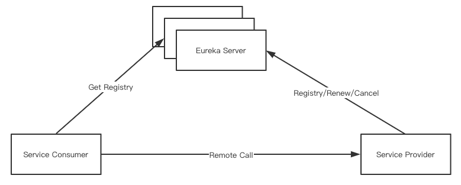

# Table of Contents

* [CloudManage](#cloudmanage)
  * [Eureka核心特性](#eureka核心特性)
    * [服务注册](#服务注册)
    * [服务续约](#服务续约)
    * [服务下线](#服务下线)
    * [获取注册列表信息](#获取注册列表信息)
  * [Eureka面试点](#eureka面试点)
    * [注册中心比较](#注册中心比较)
    * [Eureka注册慢问题](#eureka注册慢问题)
    * [Eureka的自我保护](#eureka的自我保护)
# CloudManage
微服务治理实践
## Eureka核心特性

### 服务注册
* Eureka Client在第一次心跳时Eureka Server注册
* 注册时提供诸多元数据: 主机名, 端口, 健康指标URL等
### 服务续约
* Eureka Client通过发送心跳进行续约
* 默认情况下是每30s发送一次心跳
* 如果90s内Eureka Server未收到续约, 则进行服务剔除 
### 服务下线
* Eureka Client优雅退出时会发送cancel的命令
* Eureka Server在收到cancel命令时会删除该节点
### 获取注册列表信息
* Eureka Client会缓存由Server获取的注册表信息
* Eureka Client会定期更新注册表信息, **默认是30s**
* Eureka Client会处理注册表的合并等内容
## Eureka面试点
### 注册中心比较
* 分布式基础CAP理论: 没有任何一个系统能同时满足CAP 
    * 一致性: Consistency
    * 可用性: Availability
    * 分区容错性: Partition tolerance
* 常见的注册中心: Zookeeper, Eureka等
* Eureka主要保证AP特性: 可用和容错
* Zookeeper主要保证CP特性: 一致和容错
### Eureka注册慢问题
* 根本原因在于Eureka的AP特性
* Eureka Client延迟注册, 默认30s
* Eureka Server的响应缓存, 默认30s
* Eureka Server的缓存刷新, 默认30s
### Eureka的自我保护
* Eureka Server会自动更新续约更新阈值
* 当Eureka Server续约更新频率低于阈值则进入保护模式
* 自我保护的模式下Eureka Server不会剔除任何的注册信息
